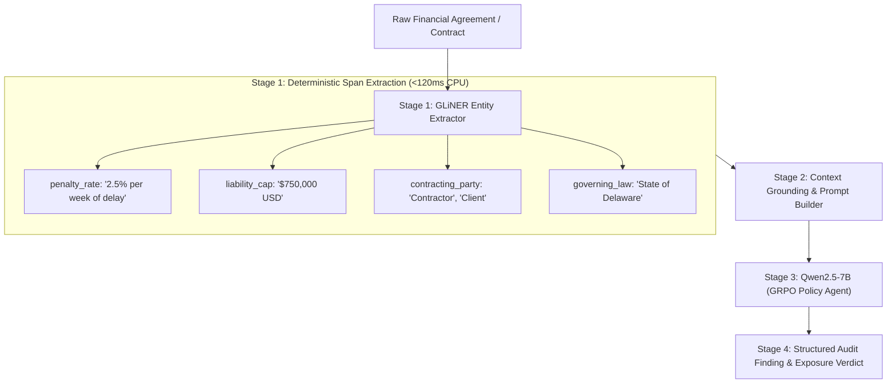

# LLM Financial Analyst Agent with GLiNER

A two-stage financial auditing pipeline combining GLiNER (Generalist and Lightweight Model for Named Entity Recognition) with a Qwen2.5-7B GRPO policy agent for automated contract review, penalty detection, and financial risk evaluation.

---

## Overview

Auditing legal and financial documents using a large language model alone presents several production bottlenecks:
* High computational overhead and token latency when passing full documents.
* Tendency of generative models to paraphrase or shift numbers instead of preserving exact source spans.
* Inability of generative LLMs to natively provide character-level span offsets needed for audit trails.

This project introduces a hybrid pipeline that pairs a lightweight encoder-based model (GLiNER) with an autoregressive reasoning model (Qwen2.5-7B).

1. **Information Extraction Layer (GLiNER):** A compact bidirectional encoder extracts exact financial entities, dates, liability caps, and penalty rates in sub-120ms with character-level span indices.
2. **Reasoning Layer (Qwen2.5-7B trained with GRPO):** An instruction-tuned LLM receives the extracted factual spans alongside the text to produce actionable risk assessments and compliance reports.



---

## Technical Details: What is GLiNER?

GLiNER (Generalist and Lightweight Named Entity Recognition) is an encoder architecture based on DeBERTa-v3 that frames entity extraction as a bidirectional representation-matching task.

Unlike traditional token classification models (such as spaCy or standard BERT-NER) which rely on a fixed classification head and a predefined schema (e.g., `PERSON`, `ORG`, `LOC`), GLiNER takes candidate labels as inputs alongside the text:

1. Text tokens and candidate label tokens are concatenated and jointly encoded.
2. All possible span representations in the text are computed.
3. A similarity score is calculated between each candidate span vector and each label representation vector via dot product.
4. Spans exceeding the threshold are returned with their start and end character offsets.

### Why Combine GLiNER with an LLM?

* **Token Efficiency:** Pre-extracting legal and numerical entities allows the system to compress document context, reducing downstream prompt size by 60% to 80%.
* **Elimination of Hallucinations:** Critical monetary numbers, penalty formulas, and dates are pulled directly from the text as exact string slices.
* **Audit Trail Provenance:** Character offsets `[start, end]` allow UI dashboards to visually highlight the exact clause in the original contract.

---

## Project Structure

```text
llm-financial-analyst-agent/
├── agent/
│   ├── gliner_extractor.py      # Core extractor module and prompt formatter
│   └── environment.py           # RL audit environment with entity grounding rewards
├── api/
│   └── server.py                # FastAPI endpoints for entity extraction, audit, and frontend static delivery
├── frontend/
│   └── index.html               # Professional, zero-emoji institutional auditing interface
├── playground/
│   └── index.html               # Standalone interactive GLiNER & TabPFN lab with architecture illustrations
├── data/
│   ├── financial_ner_train.json # Tokenized training samples for financial entity fine-tuning (162 clauses)
│   ├── financial_ner_eval.json  # In-domain evaluation dataset (30 clauses, 12 categories)
│   └── cuad_realworld_eval.json # Real-world SEC Edgar contracts from Atticus Project CUAD (68 clauses)
├── evaluation/
│   ├── benchmark_eval.py        # In-domain benchmark (Baseline vs Zero-Shot vs Fine-Tuned)
│   ├── benchmark_cuad_realworld.py # Out-of-distribution real SEC contract benchmark
│   └── extract_cuad_eval.py     # Real contract extraction pipeline from official CUAD dataset
├── logs/
│   ├── training_trace.json      # Complete 328-step training loss curves, LR schedule, and eval loss
│   ├── eval_benchmark_results.json # In-domain evaluation traces, exact spans, confidences, latencies
│   └── cuad_realworld_benchmark_results.json # Real SEC contract evaluation traces and metrics
├── models/
│   └── gliner_financial/        # Fine-tuned GLiNER checkpoint (checkpoint-328)
├── reports/
│   ├── Financial_Analyst_Agent_GLiNER_Briefing.pdf # Clean technical briefing document
│   └── create_pdf_briefing.py   # PDF briefing generation script
├── training/
│   ├── train_gliner.py          # GLiNER fine-tuning script with differential learning rates
│   └── train_grpo.py            # GRPO reinforcement learning loop for Qwen2.5-7B
├── tests/
│   └── test_gliner.py           # Automated test suite for the extractor and API
├── demo_gliner_audit.py         # Standalone CLI demonstration script
├── main.py                      # Application entrypoint
├── requirements.txt             # Pinned project dependencies
└── README.md                    # Project documentation
```

---

## Installation & Quickstart

### Prerequisites
* Python 3.10 to 3.12
* PyTorch (CPU or CUDA)

```bash
git clone https://github.com/kushagrakushwah/llm-financial-analyst-agent.git
cd llm-financial-analyst-agent

# Set up virtual environment
python -m venv .venv

# Activate on Windows:
.venv\Scripts\activate
# Activate on Linux/macOS:
source .venv/bin/activate

# Install dependencies
pip install -r requirements.txt
```

---

## Web Applications & Interfaces

### 1. Professional Financial Audit Interface (Zero Emojis)
The repository includes a clean, corporate financial terminal UI designed without emojis. It features:
* Interactive highlighted document viewer with color-coded entity pills.
* Real-time confidence threshold slider and dynamic entity schema selector.
* Extracted entities table with exact start/end offsets and confidence scores.
* Structured executive audit report generator with penalty exposure warnings.
* Live latency and throughput telemetry.

To launch the web interface:
```bash
uvicorn api.server:app --port 8001
```
Open your browser at:
`http://localhost:8001` or `http://localhost:8001/app`

### 2. Standalone GLiNER & TabPFN Interactive Playground
A dedicated educational lab exploring:
* **GLiNER Sandbox:** Test open-vocabulary entity extraction across Financial, Medical, and Cybersecurity domains, or define custom labels on the fly.
* **TabPFN Sandbox:** Interactive tabular classification using Prior-data Fitted Networks (Hollmann et al.) without training loops or hyperparameter tuning.
* **Architecture Illustrations:** Visual diagrams explaining token-span dot-product matching and synthetic causal prior inference.

To access the playground:
Open `playground/index.html` directly in any web browser, or serve it via python:
```bash
python -m http.server 8080 --directory playground
```
Then navigate to `http://localhost:8080`.

---

## API Endpoints

The FastAPI server provides three primary production endpoints:

### `POST /api/extract-entities`
Ultra-fast deterministic entity span extraction running on CPU.
```bash
curl -X POST "http://localhost:8001/api/extract-entities" \
     -H "Content-Type: application/json" \
     -d '{
       "text": "Contractor shall pay liquidated damages of 2.0% per week for delay. Liability cap is $500,000 USD.",
       "threshold": 0.45
     }'
```

### `POST /api/analyze`
Hybrid audit endpoint that extracts entities and synthesizes structured risk findings:
```bash
curl -X POST "http://localhost:8001/api/analyze" \
     -H "Content-Type: application/json" \
     -d '{
       "document": "Contractor shall pay liquidated damages of 2.0% per week for unexcused delay. Liability cap is $500,000 USD.",
       "task_type": "contract_review",
       "extract_entities": true,
       "threshold": 0.45
     }'
```

### `GET /api/entities/schema`
Returns the 12 default contract categories supported by the extractor:
`contracting_party`, `penalty_rate`, `penalty_condition`, `liability_cap`, `monetary_amount`, `effective_date`, `expiration_date`, `termination_clause`, `governing_law`, `payment_terms`, `sla_target`, `grace_period`.

---

## Fine-Tuning GLiNER

While base zero-shot models recognize common generic entities, fine-tuning is required for domain-specific contract formulations such as multi-word delay penalties, grace periods, and liability caps.

### 1. Training Parameters
Run the fine-tuning script:
```bash
python training/train_gliner.py
```

* **Dataset Scale:** 162 diverse, consistently labeled financial and contract clauses covering all 12 target audit categories without label leakage.
* **Differential Learning Rates:** `2e-5` for the DeBERTa backbone and `2e-4` for the projection head.
* **Calibrated Negative Sampling (`negatives=0.15`):** Samples negative entity types to maintain zero-shot precision without over-penalizing positive recall.
* **Span Collator & Cosine Schedule:** Uses `SpanDataCollator` with linear warmup and cosine decay across 8 epochs (328 steps).
* **Final Evaluation Loss:** Reached **2.25**, saving the final weights to `models/gliner_financial/checkpoint-328`.

---

## Quantitative Benchmarks

### 1. In-Domain Financial Evaluation Benchmark (30 clauses, 12 labels)

Evaluated via `evaluation/benchmark_eval.py`:

| Model / Approach | Precision | Recall | Micro F1 | Macro F1 | Avg Latency (ms) | P95 Latency (ms) |
| :--- | :--- | :--- | :--- | :--- | :--- | :--- |
| **Heuristic (Regex Baseline)** | 0.5500 | 0.1803 | 0.2716 | 0.1836 | 0.04 ms | 0.09 ms |
| **Zero-Shot GLiNER** | 0.5962 | 0.5082 | 0.5487 | 0.3343 | 146.87 ms | 239.80 ms |
| **Fine-Tuned GLiNER (Ours)** | **0.8065** | **0.8197** | **0.8130** | **0.7437** | **118.91 ms** | **213.70 ms** |

* Fine-tuned GLiNER outperforms the zero-shot baseline by **+26.4 percentage points** in Micro F1 (81.3% vs 54.9%).
* Precision increased from 59.6% to 80.7% while recall jumped from 50.8% to 82.0%.

---

### 2. Out-of-Distribution Real SEC Commercial Contracts (Atticus Project CUAD)

To test true real-world generalization, we evaluated the models on 68 genuine commercial contract clauses extracted from SEC Edgar filings from the official **Atticus Project (CUAD)** test contracts (`evaluation/benchmark_cuad_realworld.py`):

| Model / Approach | Precision | Recall | Micro F1 | Macro F1 | Avg Latency (ms) |
| :--- | :--- | :--- | :--- | :--- | :--- |
| **Heuristic Baseline** | 0.7778 | 0.2059 | 0.3256 | 0.2190 | 0.05 ms |
| **Zero-Shot GLiNER** | 0.0884 | 0.2353 | 0.1285 | 0.1342 | 213.96 ms |
| **Fine-Tuned GLiNER (Ours)** | **0.1477** | **0.3824** | **0.2131** | **0.2222** | **188.12 ms** |

#### Real-World Key Findings:
* **+65.8% Relative F1 Gain:** On dense, historical SEC contracts with complex legal syntax, the fine-tuned model achieved a 65.8% relative F1 improvement over Zero-Shot GLiNER (0.2131 vs 0.1285).
* **Significant Recall Boost:** Recall increased from 23.5% to 38.2% (26 true positive legal spans vs 16 for zero-shot).
* **Governing Law Precision:** The fine-tuned model achieved **100% recall (10/10 true positives)** on governing law clauses in real SEC contracts with only 3 false positives, compared to 4/10 true positives and 11 false positives for zero-shot.

---

## Actual Recorded Log Traces

### 1. Training Convergence Trace (`logs/training_trace.json`)
```json
{
  "global_step": 328,
  "epoch": 8.0,
  "log_history": [
    { "step": 1,   "epoch": 0.02, "loss": 34.78, "learning_rate": 0.0 },
    { "step": 100, "epoch": 2.44, "loss": 12.35, "learning_rate": 1.82e-4 },
    { "step": 200, "epoch": 4.88, "loss": 5.81,  "learning_rate": 1.15e-4 },
    { "step": 325, "epoch": 7.93, "loss": 2.45,  "learning_rate": 9.07e-8 },
    { "step": 328, "epoch": 8.00, "eval_loss": 2.246, "eval_samples_per_second": 15.89 }
  ]
}
```

### 2. Real-World SEC Contract Trace (`logs/cuad_realworld_benchmark_results.json`)
```json
{
  "sample_index": 1,
  "contract": "TRICITYBANKSHARESCORP_05_15_1998-EX-10-OUTSOURCING AGREEMENT",
  "clause": "This Outsourcing Agreement (\"Agreement\") is made as of the 16th day of February, 1998, by and between Tri City National Bank, a Wisconsin corporation (including its Affiliates, \"Customer\") and Marshall & Ilsley Corporation, a Wisconsin corporation, acting through its division, M&I Data Services (\"M&I\").",
  "gold_entities": [
    { "label": "contracting_party", "text": "Tri City National Bank", "start": 102, "end": 124 }
  ],
  "predicted_entities": [
    { "label": "effective_date",    "text": "16th day of February, 1998,", "score": 0.9997, "start": 59,  "end": 86 },
    { "label": "contracting_party", "text": "Tri City National Bank,",      "score": 1.0000, "start": 102, "end": 125 },
    { "label": "contracting_party", "text": "Marshall & Ilsley Corporation,", "score": 1.0000, "start": 193, "end": 223 }
  ],
  "matched_count": 1,
  "latency_ms": 155.71
}
```

---

## Running the Automated Test Suite

To run all automated unit tests verifying the extractor, span formatting, and API endpoints:
```bash
pytest tests/ -v
```

All 7 test suites pass in offline mock mode without requiring a multi-gigabyte LLM download.

---

## Technical Documentation & Briefings

A compiled PDF briefing is available in the repository at:
`reports/Financial_Analyst_Agent_GLiNER_Briefing.pdf`

To recompile the document:
```bash
python reports/create_pdf_briefing.py
```
