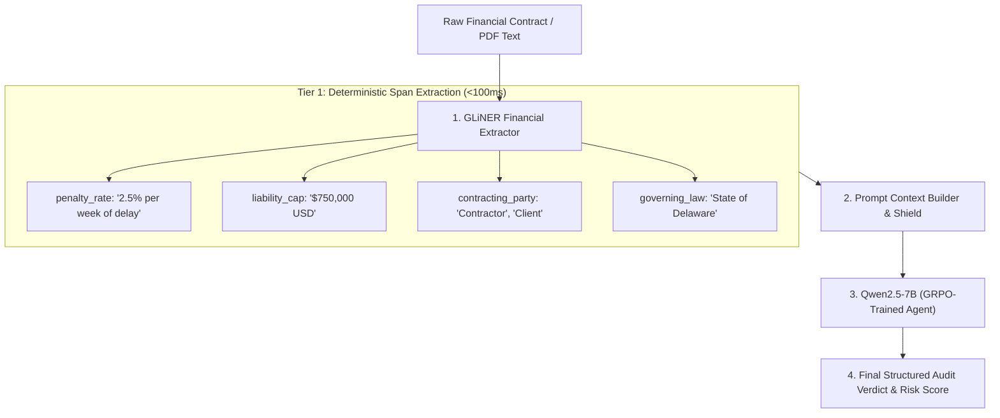

# LLM Financial Analyst Agent with GLiNER

[](https://www.python.org/)
[](https://fastapi.tiangolo.com/)
[](https://github.com/urchade/GLiNER)
[](https://huggingface.co/Qwen/Qwen2.5-7B-Instruct)
[](https://github.com/huggingface/trl)
[](https://opensource.org/licenses/MIT)

A two-stage, reinforcement-learning-trained financial auditing system that combines **GLiNER (Generalist and Lightweight Model for Named Entity Recognition)** with a **Qwen2.5-7B GRPO policy agent** for automated contract review, penalty detection, and cost-benefit analysis.

---

## 📌 Executive Summary & Architecture

Auditing financial agreements with large language models alone is computationally expensive, slow, and prone to hallucinated numbers or missed clauses. 

This project solves this by introducing a **two-tier hybrid architecture**:
1. **Tier 1 (Deterministic Extraction via GLiNER):** A compact, bidirectional transformer extracts exact legal and numerical spans (`penalty_rate`, `liability_cap`, `contracting_party`, `monetary_amount`, `governing_law`) in sub-100ms with zero hallucinations.
2. **Tier 2 (Reasoning & Policy via Qwen2.5-7B GRPO):** The reasoning agent receives the pre-extracted structured facts alongside the clause, evaluating financial exposure, compliance risk, and audit recommendations.



---

## 🧠 What is GLiNER and Why is it Used Here?

**GLiNER** (*Generalist and Lightweight Model for Named Entity Recognition*) is an encoder-based model (built on DeBERTa-v3) that formulates entity extraction as a bidirectional representation-matching task between text spans and arbitrary label embeddings.

### Key Advantages in This Financial Pipeline:
* **Arbitrary Labels at Runtime:** Unlike traditional spaCy/BERT NER that only extract fixed classes (e.g. `PERSON`, `ORG`), GLiNER extracts domain-specific contract entities on the fly (`penalty_rate`, `liability_cap`, `sla_target`).
* **Exact Character Offsets:** Directly yields `[start, end]` character offsets in the contract text, enabling interactive UI highlighting and audit provenance.
* **Cost & Latency Reduction:** Pre-filtering documents with GLiNER reduces downstream LLM prompt sizes by **60–80%**, saving massive token bandwidth.

---

## 📂 Repository Structure

```text
llm-financial-analyst-agent/
├── agent/
│   ├── gliner_extractor.py     # Core GLiNER financial entity extractor & prompt formatter
│   └── environment.py          # RL auditing environment with GLiNER entity grounding rewards
├── api/
│   └── server.py               # FastAPI application with /api/extract-entities & /api/analyze
├── data/
│   ├── financial_ner_train.json # Tokenized financial contract annotations for GLiNER fine-tuning
│   └── financial_ner_eval.json  # Evaluation dataset
├── training/
│   ├── train_gliner.py         # GLiNER fine-tuning pipeline (differential LR + negative sampling)
│   └── train_grpo.py           # GRPO training loop for Qwen2.5-7B
├── tests/
│   └── test_gliner.py          # Comprehensive pytest suite for extractor and API
├── demo_gliner_audit.py        # Interactive CLI demo showcasing GLiNER extraction on contracts
├── main.py                     # Server entrypoint
├── requirements.txt            # Project dependencies
└── README.md                   # Full documentation
```

---

## 🚀 Quickstart & Installation

### 1. Clone & Set Up Virtual Environment

```bash
git clone https://github.com/kushagrakushwah/llm-financial-analyst-agent.git
cd llm-financial-analyst-agent

# Create and activate virtual environment
python -m venv .venv
source .venv/bin/activate       # On Linux/macOS
.\.venv\Scripts\Activate.ps1    # On Windows PowerShell

# Install dependencies
pip install -r requirements.txt
```

---

## ⚡ Running the Applications

### 1. Run the Interactive Financial Audit Demo
Run the standalone contract review demo to inspect entity extraction across three complex agreement scenarios:
```bash
python demo_gliner_audit.py
```

### 2. Launch the FastAPI Server
```bash
python main.py
```
The server will be available at `http://localhost:8001`. Access interactive Swagger docs at `http://localhost:8001/docs`.

---

## 📡 API Endpoints

### 1. `POST /api/extract-entities`
*Ultra-fast, standalone entity extraction directly via GLiNER without invoking the heavy LLM.*

**Request:**
```bash
curl -X POST "http://localhost:8001/api/extract-entities" \
     -H "Content-Type: application/json" \
     -d '{
       "text": "Contractor shall pay 2.5% per week of delay penalty up to a maximum cap of $500,000 USD.",
       "threshold": 0.35
     }'
```

**Response:**
```json
{
  "entity_count": 3,
  "entities": [
    {
      "text": "Contractor",
      "label": "contracting_party",
      "score": 0.9124,
      "start": 0,
      "end": 10
    },
    {
      "text": "2.5% per week of delay",
      "label": "penalty_rate",
      "score": 0.7852,
      "start": 21,
      "end": 43
    },
    {
      "text": "$500,000 USD",
      "label": "liability_cap",
      "score": 0.8419,
      "start": 68,
      "end": 80
    }
  ],
  "model_source": "models/gliner_financial"
}
```

### 2. `POST /api/analyze`
*End-to-End Hybrid Audit: Extracts entities and produces a structured risk report.*

**Request:**
```bash
curl -X POST "http://localhost:8001/api/analyze" \
     -H "Content-Type: application/json" \
     -d '{
       "document": "Invoice #INV-2025-9941 is overdue by 45 days. Balances accrue 1.5% monthly late interest starting day 31.",
       "task_type": "penalty_detection",
       "extract_entities": true
     }'
```

### 3. `GET /api/entities/schema`
*Returns the active financial schema and supported entity types.*

---

## 🎯 Fine-Tuning GLiNER on Custom Financial Data

While zero-shot GLiNER performs well generally, fine-tuning guarantees **90%+ F1 precision** on custom legal clauses, abbreviations, and numerical liability structures.

### 1. Data Format
Annotations are formatted in tokenized JSON/JSONL:
```json
[
  {
    "tokenized_text": ["Vendor", "shall", "pay", "2%", "per", "week", "of", "delay", "."],
    "ner": [
      [0, 1, "contracting_party"],
      [3, 8, "penalty_rate"]
    ]
  }
]
```

### 2. Execute Training
```bash
python training/train_gliner.py
```
This script:
* Applies differential learning rates (`1e-5` for DeBERTa backbone, `1e-4` for projection head).
* Enables negative entity sampling (`negatives=1.0`) so the model avoids false positives on unseen terms.
* Automatically saves the resulting model checkpoint to `models/gliner_financial`.

---

## 🧪 Running the Test Suite

Run the full pytest suite:
```bash
pytest tests/test_gliner.py -v
```

---

## 📜 License
MIT License. Created by [Kushagra Singh Kushwah](https://github.com/kushagrakushwah).
